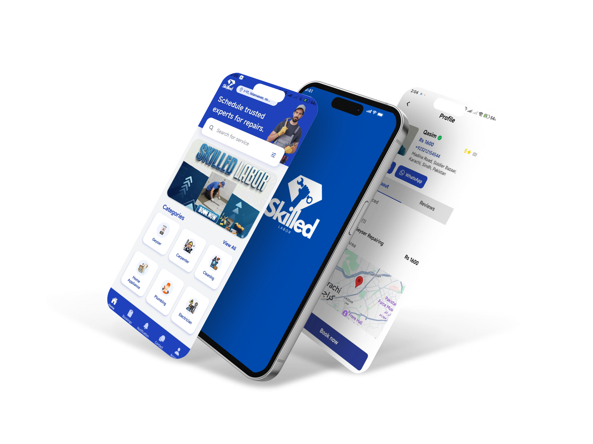

# Skilled Labor App

A full-stack service marketplace connecting **customers** with **skilled laborers** (plumbers, electricians, carpenters, etc.) for home services. Built with **React Native** (Expo) for mobile, **Node.js/Express** for the backend, and **React/Vite** for the admin dashboard.

---

## Table of Contents

- [Overview](#overview)
- [Tech Stack](#tech-stack)
- [Project Structure](#project-structure)
- [Features](#features)
- [Data Models](#data-models)
- [API Reference](#api-reference)
- [Real-Time Chat (Socket.IO)](#real-time-chat-socketio)
- [Mobile App Screens](#mobile-app-screens)
- [Admin Dashboard](#admin-dashboard)
- [Getting Started](#getting-started)
- [Environment Variables](#environment-variables)
- [Scripts](#scripts)

---

## Overview

The platform supports three user roles:

| Role         | Description                                                                        |
| ------------ | ---------------------------------------------------------------------------------- |
| **Customer** | Browse services, book laborers, chat, rate completed jobs                          |
| **Laborer**  | Manage service offerings, accept/decline jobs, track earnings, chat with customers |
| **Admin**    | Verify laborers, moderate accounts, manage categories/bookings, view analytics     |

The system consists of three applications:

1. **Mobile App** — React Native (Expo Router) for both customers and laborers
2. **Backend API** — Node.js + Express + MongoDB with Socket.IO for real-time features
3. **Admin Dashboard** — React + Vite + Tailwind CSS web application

---

## Tech Stack

| Layer            | Technology                                                     |
| ---------------- | -------------------------------------------------------------- |
| Mobile App       | React Native 0.81, Expo SDK 54, Expo Router 6, TypeScript      |
| Backend          | Node.js, Express 4.18, Mongoose 7.6, Socket.IO 4.8             |
| Database         | MongoDB                                                        |
| Admin Dashboard  | React 19, Vite, Tailwind CSS 4, React Router DOM 7, TypeScript |
| Authentication   | JWT (jsonwebtoken), bcryptjs                                   |
| File Upload      | Multer (10MB limit, images only)                               |
| Real-Time        | Socket.IO (server + client)                                    |
| Maps             | react-native-maps, expo-location                               |
| PDF/Excel Export | jsPDF, jspdf-autotable, xlsx, file-saver                       |

---

## Project Structure

```
skilled-labor-app/
├── app/                          # Mobile app (Expo Router)
│   ├── _layout.tsx               # Root layout with providers
│   ├── index.tsx                 # Entry screen
│   ├── (auth)/                   # Authentication screens
│   │   ├── role-selection.tsx    # Choose customer or laborer
│   │   ├── login.tsx             # Customer login
│   │   ├── signup.tsx            # Customer registration
│   │   ├── verification.tsx      # Customer verification
│   │   ├── laborer-login.tsx     # Laborer login
│   │   ├── laborer-signup.tsx    # Laborer registration
│   │   └── laborer-verification.tsx  # Laborer ID verification
│   ├── (customer)/               # Customer screens
│   │   ├── (tabs)/               # Bottom tab navigation
│   │   │   ├── home.tsx          # Browse categories & featured laborers
│   │   │   ├── bookings.tsx      # Upcoming & past bookings
│   │   │   ├── chat.tsx          # Chat inbox
│   │   │   ├── notification.tsx  # Notifications
│   │   │   └── account.tsx       # Account settings
│   │   ├── all-categories.tsx    # All service categories
│   │   ├── category/[id].tsx     # Category with subcategories
│   │   ├── subcategory/[id].tsx  # Subcategory with laborers
│   │   ├── laborer/[id].tsx      # Laborer profile & reviews
│   │   ├── booking/              # Booking flow
│   │   ├── booking-details/      # Booking details view
│   │   ├── conversation/[id].tsx # Chat conversation
│   │   ├── profile/edit.tsx      # Edit profile
│   │   └── settings.tsx          # App settings
│   ├── (laborer)/                # Laborer screens
│   │   ├── (tabs)/               # Bottom tab navigation
│   │   │   ├── home.tsx          # Incoming job requests
│   │   │   ├── dashboard.tsx     # Earnings & stats
│   │   │   ├── jobs.tsx          # Job listings
│   │   │   ├── chat.tsx          # Chat inbox
│   │   │   ├── notification.tsx  # Notifications
│   │   │   ├── service.tsx       # Manage services
│   │   │   ├── profile.tsx       # View profile
│   │   │   └── account.tsx       # Account settings
│   │   ├── job-details/[id].tsx  # Job details (accept/start/complete)
│   │   ├── conversation/[id].tsx # Chat conversation
│   │   ├── profile/edit.tsx      # Edit profile
│   │   ├── location/edit.tsx     # Update location
│   │   └── verification-details.tsx  # Verification status
│   ├── (admin)/                  # Admin screens (mobile)
│   │   ├── dashboard.tsx         # Admin overview
│   │   ├── users.tsx             # User management
│   │   ├── verifications.tsx     # Pending verifications
│   │   ├── verification-details/[id].tsx  # Review verification
│   │   └── notifications.tsx     # Admin notifications
│   └── context/
│       └── BookingsContext.tsx    # Bookings state management
├── backend/                      # Node.js API server
│   ├── server.js                 # Express + Socket.IO entry point
│   ├── config/
│   │   └── db.js                 # MongoDB connection with retry
│   ├── models/                   # Mongoose schemas (13 models)
│   │   ├── User.js               # Laborer & Admin accounts
│   │   ├── Customer.js           # Customer accounts
│   │   ├── Booking.js            # Service bookings
│   │   ├── Chat.js               # Chat rooms (per booking)
│   │   ├── Message.js            # Chat messages
│   │   ├── Category.js           # Service categories
│   │   ├── Subcategory.js        # Service subcategories
│   │   ├── ServiceOffering.js    # Laborer service offerings
│   │   ├── Notification.js       # In-app notifications
│   │   ├── Review.js             # Laborer reviews
│   │   ├── JobRating.js          # Post-job ratings
│   │   ├── AuditLog.js           # Admin action audit trail
│   │   └── Counter.js            # Auto-increment sequences
│   ├── controllers/              # Route handlers
│   ├── routes/                   # Express route definitions
│   ├── middleware/                # Auth, error handling, uploads
│   ├── utils/                    # Helpers (notifications, ratings)
│   └── uploads/                  # Uploaded files storage
├── admin-dashboard/              # React web admin panel
│   └── src/
│       ├── App.tsx               # Router with protected routes
│       ├── pages/                # Dashboard, Users, Services, Bookings, Login
│       └── components/           # Layout, Modal, UserDetailsModal
├── components/                   # Shared mobile components
├── constants/                    # API URL, categories, colors
├── context/                      # Global contexts
│   ├── ThemeContext.tsx           # Light/dark/system theme
│   ├── UserContext.tsx            # User data
│   └── SocketContext.tsx          # Socket.IO connection & unread counts
└── assets/                       # Fonts, images, icons
```

---

## Features

### Customer Features

- **Browse Services** — Explore 12 service categories (Electrician, Plumber, Carpenter, Painter, HVAC, Roofing, Tiling, Cleaning, Gardening, Mounting, Assembly, Moving, Appliance Repair) with subcategories and price ranges
- **Search & Book Laborers** — Find laborers by service/subcategory, view profiles and reviews, create bookings with scheduling
- **Booking Management** — Track bookings through their full lifecycle (Pending → Accepted → In Progress → Completed), cancel or reschedule
- **Real-Time Chat** — 1:1 messaging with laborers per booking, unread message badges, read receipts
- **Rate & Review** — Rate completed jobs (0.5–5 stars) with comments
- **Notifications** — Real-time updates for booking status changes, messages, and more
- **Profile Management** — Edit profile, upload profile photo, update location
- **AI Assistant Chatbot** — In-app support assistant with fast app-aware responses for booking flow, service/pricing queries, and booking status help

### Laborer Features

- **Service Offerings** — Create and manage service offerings with custom pricing per subcategory
- **Job Management** — Accept/decline incoming requests, start jobs, mark as completed, upload work photos
- **Earnings Dashboard** — Track completed jobs, earnings, and performance stats
- **Verification System** — Submit ID documents and profile for admin verification (unverified → pending → approved/rejected)
- **Real-Time Chat** — Communicate with customers per booking
- **Location Tracking** — GPS-based location updates for customer visibility
- **Availability Toggle** — Control online/offline status (going online requires a valid current location)

### Admin Features

- **Dashboard Analytics** — Overview statistics (total users, bookings, revenue, active laborers)
- **User Management** — View all customers and laborers, manage accounts
- **Laborer Verification** — Review submitted documents, approve or reject with feedback
- **Account Moderation** — Warn, temporarily block, or permanently block laborers; full warning/block history
- **Category Management** — Create, edit, delete service categories and subcategories
- **Booking Oversight** — View and manage all bookings across the platform
- **Audit Logging** — All admin actions tracked with IP address and user agent
- **Data Export** — Export data as PDF or Excel files

### Platform Features

- **JWT Authentication** — Role-based access control with separate flows for customers, laborers, and admins
- **Real-Time Communication** — Socket.IO powered chat with automatic deactivation after job completion
- **Theme Support** — Light, dark, and system-based theme switching
- **Image Upload** — Profile photos, ID cards, category icons, subcategory images, and work photos (max 10MB)
- **Offline Resilience** — API retry logic and AsyncStorage caching for bookings
- **Database Resilience** — MongoDB connection with exponential backoff retry (up to 5 attempts)
- **Chatbot Reliability Guardrails** — Cached service catalog, deterministic app-support replies, strict non-empty fallback, and bounded AI timeout/failover

---

## Data Models

### User (Laborer / Admin)

| Field                         | Type                    | Description                                        |
| ----------------------------- | ----------------------- | -------------------------------------------------- |
| `name`                        | String                  | Full name                                          |
| `email`                       | String                  | Unique email                                       |
| `password`                    | String                  | Hashed password                                    |
| `role`                        | Enum                    | `customer`, `laborer`, `admin`                     |
| `phone`, `dob`, `address`     | String                  | Personal details                                   |
| `category`                    | ObjectId (ref Category) | Primary category                                   |
| `categories`                  | [ObjectId]              | All assigned categories                            |
| `subcategories`               | [ObjectId]              | Assigned subcategories                             |
| `status`                      | Enum                    | `unverified`, `pending`, `approved`, `rejected`    |
| `accountStatus`               | Enum                    | `active`, `warned`, `temp_blocked`, `perm_blocked` |
| `warnings`                    | Array                   | Warning history                                    |
| `blockInfo`                   | Object                  | Block reason, type, date                           |
| `currentLocation`             | Object                  | `{ latitude, longitude, address }`                 |
| `isAvailable`                 | Boolean                 | Online/offline toggle                              |
| `rating`                      | Number                  | Average rating                                     |
| `completedJobs`               | Number                  | Total completed jobs                               |
| `profileImage`, `idCardImage` | String                  | Uploaded file paths                                |
| `verificationHistory`         | Array                   | Verification submission snapshots                  |

### Customer

| Field                           | Type   | Description                        |
| ------------------------------- | ------ | ---------------------------------- |
| `firstName`, `lastName`, `name` | String | Name fields                        |
| `email`, `phone`, `password`    | String | Auth & contact                     |
| `profileImage`                  | String | Profile photo path                 |
| `currentLocation`               | Object | `{ latitude, longitude, address }` |
| `status`                        | Enum   | `active`, `inactive`               |

### Booking

| Field                           | Type                    | Description                                                                               |
| ------------------------------- | ----------------------- | ----------------------------------------------------------------------------------------- |
| `customer`                      | ObjectId (ref Customer) | Booking customer                                                                          |
| `laborer`                       | ObjectId (ref User)     | Assigned laborer                                                                          |
| `service`, `serviceDescription` | String                  | Service details                                                                           |
| `scheduledAt`                   | Date                    | Scheduled date/time                                                                       |
| `location`                      | Object                  | `{ address, latitude, longitude }`                                                        |
| `compensation`                  | Number                  | Agreed price                                                                              |
| `status`                        | Enum                    | `Pending`, `Accepted`, `Declined`, `In Progress`, `Completed`, `Cancelled`, `Rescheduled` |
| `paymentStatus`                 | Enum                    | `Pending`, `Paid`                                                                         |
| `workPhotos`                    | [String]                | Uploaded work photo paths                                                                 |
| `log`                           | Array                   | Action history (who did what, when)                                                       |

### Chat & Message

| Field                                       | Type              | Description                     |
| ------------------------------------------- | ----------------- | ------------------------------- |
| **Chat**: `booking`                         | ObjectId (unique) | One chat per booking            |
| **Chat**: `customer`, `laborer`             | ObjectId          | Participants                    |
| **Chat**: `lastMessage`                     | Object            | Preview text, sender, timestamp |
| **Chat**: `unreadCustomer`, `unreadLaborer` | Number            | Unread counts                   |
| **Chat**: `isActive`                        | Boolean           | Disabled after job completion   |
| **Message**: `chat`                         | ObjectId          | Parent chat                     |
| **Message**: `senderId`, `senderRole`       | Mixed             | Message author                  |
| **Message**: `text`, `read`                 | String, Boolean   | Content & read status           |

### Other Models

- **Category** — `name` (unique), `icon` (image path)
- **Subcategory** — `category` (ref), `name`, `description`, `minPrice`, `maxPrice`, `picture`
- **ServiceOffering** — `laborer` (ref), `category` (ref), `subcategory` (ref), `price`, `description`, `isActive`
- **Notification** — `recipient`, `type` (12 types), `title`, `message`, `data`, `isRead`
- **Review** — `laborer`, `customer`, `rating` (1–5), `comment`
- **JobRating** — `booking`, `laborer`, `customer`, `rating` (0.5–5), `comment`
- **AuditLog** — `adminId`, `adminName`, `action`, `targetId`, `targetModel`, `details`, `ipAddress`, `userAgent`

---

## API Reference

### Authentication

| Method | Endpoint               | Auth   | Description            |
| ------ | ---------------------- | ------ | ---------------------- |
| POST   | `/api/users`           | Public | Register laborer/admin |
| POST   | `/api/users/login`     | Public | Login laborer/admin    |
| POST   | `/api/customers`       | Public | Register customer      |
| POST   | `/api/customers/login` | Public | Login customer         |

### Users (Laborers & Admins)

| Method | Endpoint                            | Auth      | Description                   |
| ------ | ----------------------------------- | --------- | ----------------------------- |
| GET    | `/api/users`                        | Admin     | List all users                |
| GET    | `/api/users/profile`                | Protected | Get own profile               |
| GET    | `/api/users/:id`                    | Protected | Get user by ID                |
| GET    | `/api/users/:id/public`             | Public    | Public laborer profile        |
| PUT    | `/api/users/:id/status`             | Admin     | Update verification status    |
| PUT    | `/api/users/:id/account-action`     | Admin     | Warn/block/unblock            |
| PUT    | `/api/users/:id/verification`       | Protected | Submit verification documents |
| PUT    | `/api/users/location`               | Protected | Update current location       |
| PUT    | `/api/users/availability`           | Protected | Toggle availability           |
| PUT    | `/api/users/subcategories`          | Protected | Update subcategories          |
| PUT    | `/api/users/change-password`        | Protected | Change password               |
| GET    | `/api/users/notifications`          | Protected | Get notifications             |
| PUT    | `/api/users/notifications/:id/read` | Protected | Mark notification read        |

### Customers

| Method | Endpoint                          | Auth     | Description          |
| ------ | --------------------------------- | -------- | -------------------- |
| GET    | `/api/customers/me`               | Customer | Get own profile      |
| PUT    | `/api/customers/me`               | Customer | Update profile       |
| PUT    | `/api/customers/me/password`      | Customer | Change password      |
| PUT    | `/api/customers/me/profile-image` | Customer | Upload profile image |
| PUT    | `/api/customers/me/location`      | Customer | Update location      |
| GET    | `/api/customers`                  | Admin    | List all customers   |
| GET    | `/api/customers/:id`              | Admin    | Get customer by ID   |
| DELETE | `/api/customers/:id`              | Admin    | Delete customer      |

### Bookings

| Method | Endpoint                       | Auth      | Description                     |
| ------ | ------------------------------ | --------- | ------------------------------- |
| GET    | `/api/bookings`                | Admin     | List all bookings               |
| POST   | `/api/bookings`                | Protected | Create booking                  |
| GET    | `/api/bookings/my`             | Protected | Customer's bookings             |
| GET    | `/api/bookings/laborer`        | Protected | Laborer's jobs                  |
| GET    | `/api/bookings/:id`            | Protected | Get booking details             |
| PUT    | `/api/bookings/:id/accept`     | Laborer   | Accept job                      |
| PUT    | `/api/bookings/:id/decline`    | Laborer   | Decline job                     |
| PUT    | `/api/bookings/:id/start`      | Laborer   | Start job                       |
| PUT    | `/api/bookings/:id/complete`   | Laborer   | Complete job (deactivates chat) |
| PUT    | `/api/bookings/:id/cancel`     | Protected | Cancel booking                  |
| PUT    | `/api/bookings/:id/reschedule` | Protected | Reschedule booking              |
| POST   | `/api/bookings/:id/rate`       | Protected | Rate completed job              |
| POST   | `/api/bookings/:id/photos`     | Laborer   | Upload work photos (up to 10)   |

### Categories & Subcategories

| Method | Endpoint                                    | Auth   | Description                 |
| ------ | ------------------------------------------- | ------ | --------------------------- |
| GET    | `/api/categories`                           | Public | List all categories         |
| POST   | `/api/categories`                           | Admin  | Create category (with icon) |
| GET    | `/api/categories/:id`                       | Public | Get category                |
| PUT    | `/api/categories/:id`                       | Admin  | Update category             |
| DELETE | `/api/categories/:id`                       | Admin  | Delete category             |
| GET    | `/api/categories/:categoryId/subcategories` | Public | List subcategories          |
| GET    | `/api/subcategories/search`                 | Public | Search subcategories        |
| POST   | `/api/subcategories`                        | Admin  | Create subcategory          |
| PUT    | `/api/subcategories/:id`                    | Admin  | Update subcategory          |
| DELETE | `/api/subcategories/:id`                    | Admin  | Delete subcategory          |

### Services

| Method | Endpoint                        | Auth    | Description                    |
| ------ | ------------------------------- | ------- | ------------------------------ |
| POST   | `/api/services`                 | Laborer | Create/update service offering |
| GET    | `/api/services/mine`            | Laborer | List own offerings             |
| DELETE | `/api/services/:id`             | Laborer | Delete offering                |
| GET    | `/api/services/search-laborers` | Public  | Search laborers by service     |

### Chat

| Method | Endpoint                          | Auth      | Description                  |
| ------ | --------------------------------- | --------- | ---------------------------- |
| GET    | `/api/chat/my-chats`              | Protected | Get all user's chats         |
| GET    | `/api/chat/by-booking/:bookingId` | Protected | Get/create chat for booking  |
| GET    | `/api/chat/:chatId/messages`      | Protected | Get messages (paginated)     |
| POST   | `/api/chat/:chatId/messages`      | Protected | Send message (REST fallback) |

### Chatbot (Customer Support)

| Method | Endpoint                   | Auth     | Description                                        |
| ------ | -------------------------- | -------- | -------------------------------------------------- |
| POST   | `/api/chatbot/message`     | Customer | Send message and receive assistant reply           |
| GET    | `/api/chatbot/history`     | Customer | Get active chatbot conversation history            |
| DELETE | `/api/chatbot/history`     | Customer | Clear/reset chatbot conversation                   |
| GET    | `/api/chatbot/suggestions` | Customer | Get quick starter suggestions for customer support |

### Dashboard

| Method | Endpoint                       | Auth    | Description         |
| ------ | ------------------------------ | ------- | ------------------- |
| GET    | `/api/dashboard`               | Admin   | Platform statistics |
| GET    | `/api/dashboard/laborer-stats` | Laborer | Personal stats      |

---

## Real-Time Chat (Socket.IO)

### Connection

- Clients connect to the server with JWT token: `io(API_URL, { auth: { token } })`
- Server verifies token and extracts `userId` and `userRole`
- Each user auto-joins a personal room `user_{userId}` for notifications

### Events

| Event          | Direction          | Payload                   | Description                             |
| -------------- | ------------------ | ------------------------- | --------------------------------------- |
| `joinChat`     | Client → Server    | `chatId`                  | Join chat room                          |
| `leaveChat`    | Client → Server    | `chatId`                  | Leave chat room                         |
| `sendMessage`  | Client → Server    | `{ chatId, text }`        | Send message (blocked if chat inactive) |
| `newMessage`   | Server → Chat Room | `Message` object          | New message broadcast                   |
| `chatUpdate`   | Server → User Room | `{ chatId, lastMessage }` | Inbox badge update for recipient        |
| `markRead`     | Client → Server    | `chatId`                  | Mark messages as read                   |
| `messagesRead` | Server → Chat Room | `{ chatId, readBy }`      | Read receipt notification               |

### Chat Lifecycle

1. Chat is created when a booking is **Accepted** or **In Progress**
2. Both parties can send messages in real-time
3. When a job is **Completed**, the chat's `isActive` flag is set to `false`
4. Both Socket.IO and REST endpoints block sending to inactive chats
5. The UI shows a locked banner: _"This chat is closed. The job has been completed."_

### Auth Flow

| Screen                | Description                                 |
| --------------------- | ------------------------------------------- |
| Role Selection        | Choose between Customer and Laborer         |
| Customer Login/Signup | Email-based customer authentication         |
| Laborer Login/Signup  | Email-based laborer authentication          |
| Laborer Verification  | Upload ID card and profile for admin review |

### Customer Screens

| Screen             | Description                                      |
| ------------------ | ------------------------------------------------ |
| Home               | Browse categories, view featured/nearby laborers |
| All Categories     | Grid view of all 12+ service categories          |
| Category Detail    | View subcategories under a category              |
| Subcategory Detail | List of available laborers for a subcategory     |
| Laborer Profile    | View laborer details, services, reviews, ratings |
| Create Booking     | Schedule a service with a laborer                |
| Booking Details    | View booking status, timeline, actions           |
| Bookings List      | Upcoming and completed bookings                  |
| Chat Inbox         | List of active conversations                     |
| Chat Conversation  | Real-time messaging with laborer                 |
| Notifications      | Booking updates, system messages                 |
| Profile Edit       | Update personal information and photo            |
| Settings           | Theme, preferences                               |

### Laborer Screens

| Screen               | Description                                       |
| -------------------- | ------------------------------------------------- |
| Home                 | View incoming job requests                        |
| Dashboard            | Earnings, completed jobs, performance             |
| Jobs                 | Pending, active, and completed job listings       |
| Job Details          | Accept/decline/start/complete jobs, upload photos |
| Services             | Manage service offerings and pricing              |
| Chat Inbox           | List of customer conversations                    |
| Chat Conversation    | Real-time messaging with customer                 |
| Notifications        | Job updates, account alerts                       |
| Profile              | View and edit laborer profile                     |
| Location             | Update GPS location on map                        |
| Verification Details | View verification status and history              |
| Settings             | Theme, preferences                                |

### Admin Screens (Mobile)

| Screen               | Description                          |
| -------------------- | ------------------------------------ |
| Dashboard            | Platform overview and statistics     |
| Users                | User management and moderation       |
| Verifications        | Review pending laborer verifications |
| Verification Details | Approve/reject with feedback         |
| Notifications        | Admin-specific notifications         |

---

## Admin Dashboard

The web-based admin dashboard at `admin-dashboard/` provides:

| Page          | Description                                                             |
| ------------- | ----------------------------------------------------------------------- |
| **Login**     | Admin authentication                                                    |
| **Dashboard** | Total users, bookings, revenue, active laborers overview with charts    |
| **Users**     | View and manage all customers and laborers; warn/block/unblock accounts |
| **Services**  | CRUD for categories and subcategories with image uploads                |
| **Bookings**  | View all bookings, filter by status, manage lifecycle                   |

**Additional Capabilities:**

- PDF export (jsPDF + jspdf-autotable)
- Excel export (xlsx + file-saver)
- Responsive sidebar layout
- Protected routes with localStorage-based auth

---

## Getting Started

### Prerequisites

- **Node.js** >= 18.x
- **MongoDB** (local or Atlas cloud instance)
- **Expo CLI** (installed globally or via npx)
- **npm** or **yarn**

### 1. Clone the Repository

```bash
git clone <repository-url>
cd "Skilled Labor App"
```

### 2. Backend Setup

```bash
cd backend
npm install
```

Create a `.env` file in the `backend/` directory:

```env
PORT=5000
MONGO_URI=mongodb://localhost:27017/skilled-labor-app
JWT_SECRET=your_jwt_secret_key
```

Start the backend server:

```bash
# Development (with hot reload)
npm run dev

# Production
npm start
```

### 3. Mobile App Setup

```bash
# From project root
npm install
```

Update the API URL in `constants/Api.ts` to point to your backend:

```typescript
export const API_URL = "http://<your-ip>:5000";
```

Or set `EXPO_PUBLIC_API_URL` before starting Expo (recommended):

```bash
# PowerShell
$env:EXPO_PUBLIC_API_URL="http://<your-ip>:5000"
npm start
```

Note: Backend auto-retries ports if 5000 is occupied (5001, 5002, ...). If this happens, point `EXPO_PUBLIC_API_URL` to the active backend port shown in backend logs.

Start the Expo development server:

```bash
npm start
# or
npx expo start
```

Scan the QR code with **Expo Go** on your device, or press:

- `a` — Open on Android emulator
- `i` — Open on iOS simulator
- `w` — Open in web browser

### 4. Admin Dashboard Setup

```bash
cd admin-dashboard
npm install
```

Update the API base URL in `src/api/` if different from default.

Start the development server:

```bash
npm run dev
```

The dashboard opens at `http://localhost:5173`.

### 5. Seed Data (Optional)

```bash
cd backend

# Seed categories and subcategories
node seed_data.js

# Create an admin account
node seedAdmin.js
```

---

## Environment Variables

### Backend (`backend/.env`)

| Variable                  | Description                                         | Default                              |
| ------------------------- | --------------------------------------------------- | ------------------------------------ |
| `PORT`                    | Server port                                         | `5000`                               |
| `MONGO_URI`               | MongoDB connection string                           | —                                    |
| `JWT_SECRET`              | JWT signing secret                                  | `secret`                             |
| `OPENROUTER_API_KEY`      | API key for customer chatbot and AI recommendations | —                                    |
| `OPENROUTER_PICKUP_MODEL` | Optional model override for pickup recommendations  | `mistralai/mistral-7b-instruct:free` |

---

## Scripts

### Root (Mobile App)

| Script            | Description                   |
| ----------------- | ----------------------------- |
| `npm start`       | Start Expo development server |
| `npm run android` | Start on Android              |
| `npm run ios`     | Start on iOS                  |
| `npm run web`     | Start on web                  |

### Backend

| Script        | Description                     |
| ------------- | ------------------------------- |
| `npm start`   | Start production server         |
| `npm run dev` | Start with nodemon (hot reload) |
| `npm test`    | Run Jest tests                  |

### Admin Dashboard

| Script            | Description                           |
| ----------------- | ------------------------------------- |
| `npm run dev`     | Start Vite dev server                 |
| `npm run build`   | TypeScript compile + production build |
| `npm run lint`    | Run ESLint                            |
| `npm run preview` | Preview production build              |

---

## Middleware

| Middleware        | File                 | Description                                                                   |
| ----------------- | -------------------- | ----------------------------------------------------------------------------- |
| `protect`         | `authMiddleware.js`  | JWT verification; hydrates `req.user` or `req.customer`; updates `lastActive` |
| `admin`           | `authMiddleware.js`  | Requires `req.user.role === 'admin'`                                          |
| `customerProtect` | `customerAuth.js`    | JWT verification for Customer model                                           |
| `errorHandler`    | `errorMiddleware.js` | Global error handler with JSON responses                                      |
| `upload`          | `upload.js`          | Multer config: disk storage, 10MB limit, images only                          |

---

## License

ISC
